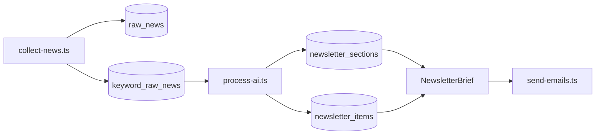

# Overnight Brief — 뉴스레터 형식 스펙

> **핵심:** `keywords.news_count` = 키워드당 **수집하는 뉴스 개수**. 가공(process)은 수집된 그 N건을 기반으로 **키워드별 인사이트 + 기사별 3줄 요약**을 만든다.

## 1. 파이프라인



| 단계 | 입력 | 출력 |
|------|------|------|
| **수집** | 유저 키워드 + `news_count` | `raw_news` + `keyword_raw_news` (키워드↔기사 매핑) |
| **가공** | 키워드별 수집 N건 | `newsletter_sections.insight_ko` + `newsletter_items.summary_ko` |
| **발송** | sections + items | HTML / Slack / Discord |

**중요:** 가공은 substring 키워드 매칭을 하지 않는다. `keyword_raw_news`에 기록된 **실제 수집 결과**만 사용한다.

## 2. 뉴스레터 본문 구조

유저 1명 · 하루 1통. 키워드 등록 순으로 **섹션** 구성.

```
HEADER
  Overnight Brief · {date}
  오늘 N건 · 키워드 M개

SECTION #키워드1
  [오늘의 인사이트]  ← GPT 종합 3줄 (insight_ko)
  Item #1: 원문 제목 · 3줄 요약 · 원문 링크
  Item #2 ...
  (건수 = 해당 유저 keywords.news_count, 수집된 만큼)

SECTION #키워드2
  ...

FOOTER
```

### 2-1. 키워드 섹션 (`newsletter_sections`)

| 필드 | 설명 |
|------|------|
| `matched_keyword` | 섹션 키워드 |
| `insight_ko` | 수집 N건을 종합한 **3줄 인사이트** (`\n` 구분) |
| `briefing_date` | 발송 대상일 (KST) |

### 2-2. 기사 아이템 (`newsletter_items`)

| 필드 | 설명 |
|------|------|
| `matched_keyword` | 소속 섹션 키워드 |
| `raw_news_id` | 수집 원문 FK |
| `summary_ko` | **해당 기사** 3줄 한국어 요약 |
| `importance_rank` | 섹션 내 중요도 (1=가장 중요) |

### 2-3. 수집 매핑 (`keyword_raw_news`)

| 필드 | 설명 |
|------|------|
| `keyword` | 수집에 사용한 검색 키워드 |
| `raw_news_id` | 저장된 기사 |
| `collection_date` | 수집일 (KST, process와 동일) |
| `rank_in_batch` | 해당 키워드 수집 순서 (1..N) |

동일 URL이 여러 키워드에 걸리면 **키워드별로 별도 row** (유저 뉴스레터에서는 각 섹션에 해당 기사 포함).

## 3. 유저별 `news_count` 처리

- **수집(collect):** 전 유저 키워드 중 같은 문자열 키워드의 `news_count` **최댓값**으로 N건 수집
- **가공(process):** 각 유저의 `keywords.news_count`만큼 `keyword_raw_news`에서 **앞에서 N건** (`rank_in_batch` 순)

예: 키워드 "AI" 수집 2건, 유저 A `news_count=1` → A는 1건만, 유저 B `news_count=2` → 2건 전부

## 4. GPT 가공 규칙

키워드당 GPT **1회**. 입력 = 해당 유저·키워드에 할당된 수집 N건 전체.

```json
{
  "insight_ko": "종합 1줄.\n종합 2줄.\n종합 3줄.",
  "items": [
    {
      "raw_index": 0,
      "summary_ko": "기사1 1줄.\n기사1 2줄.\n기사1 3줄.",
      "importance_rank": 1
    }
  ]
}
```

- `insight_ko`: 3줄 (한국 IT 종사자 관점 종합)
- `items`: **입력 기사 전부** 포함 (누락 불가)
- 각 `summary_ko`: 3줄
- `importance_rank`: 1부터 연속

## 5. 채널별 표현

| 채널 | 섹션 | 인사이트 | 기사 |
|------|------|----------|------|
| Email | `<h2>#키워드</h2>` | 파란 박스 "오늘의 인사이트" 3줄 | 카드 + 3줄 `<ul>` + 원문 링크 |
| Slack/Discord | `## #키워드` | `💡 오늘의 인사이트` 3줄 | 번호 + 제목 + 3줄 + URL |

제목: `[Overnight Brief] {date} 오늘의 글로벌 테크 브리핑`

## 6. 예시 (plain text)

```
오늘 3건 · 키워드 1개

## #OpenAI

💡 오늘의 인사이트
OpenAI가 하드웨어·칩까지 영역을 확장하고 있다.
경쟁사 대비 추론 인프라 내재화가 가속화되는 흐름이다.
한국 개발팀도 API 의존도 점검이 필요하다.

1. OpenAI unveils its first custom chip...
(3줄 요약)
https://techcrunch.com/...

2. It's not about Anthropic vs. OpenAI anymore
(3줄 요약)
https://techcrunch.com/...
```

## 7. 마이그레이션

Supabase SQL 에디터에서 순서대로 실행:

1. `0006_keyword_collections_and_sections.sql`
2. `0007_newsletter_items_unique_per_keyword.sql` (키워드별 동일 기사 허용)

기존 `raw_news`만 있고 `keyword_raw_news`가 없으면 **`npm run collect` 재실행** 후 `npm run process`.

## 8. 관련 코드

| 파일 | 역할 |
|------|------|
| `scripts/collect-news.ts` | 수집 + `keyword_raw_news` 저장 |
| `scripts/process-ai.ts` | GPT 가공 + sections/items 저장 |
| `lib/openai.ts` | `summarizeKeywordNewsletter()` |
| `lib/load-newsletter-brief.ts` | sections + items → `NewsletterBrief` |
| `lib/email-template.ts` | HTML 렌더 |
| `lib/notifier.ts` | Slack/Discord 텍스트 |
